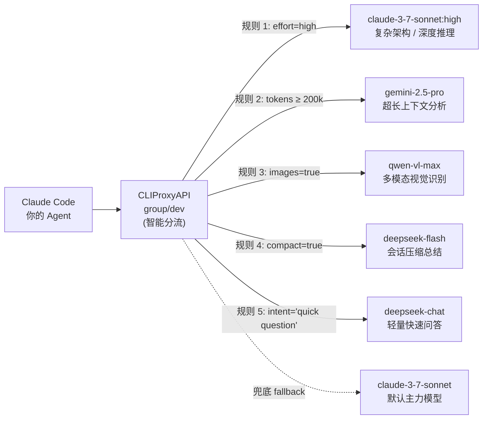

# CPA Intent Router

基于 CLIProxyAPI 动态插件体系实现的上下文感知与小模型意图分类两阶段动态模型路由插件。

---

## 路由架构与规则分流示意



---

## 使用方式

分流路由不限定特定 API 路径，所有支持的推理接口（如 `/v1/chat/completions`、`/v1/messages`、`/v1/responses` 等）均完全支持。只需在请求时将模型名称指定为**虚拟组标识**即可触发两阶段分流：

### 1. 触发分流与常规透传机制

- **触发智能分流**：客户端请求的 `model` 字段填入组 ID（如 `opus-anywhere`）或带前缀的 `group/<id>`（如 `group/opus-anywhere`）。
- **常规原生请求透传**：若客户端请求具体模型名称（如 `claude-sonnet-4-6`、`deepseek-flash`），插件直接忽略并由宿主原样处理，零额外开销。

### 2. 客户端调用示例

#### OpenAI 兼容协议接口 (`/v1/chat/completions`)

```bash
curl -X POST http://<host>:<port>/v1/chat/completions \
  -H "Content-Type: application/json" \
  -H "Authorization: Bearer <your-token>" \
  -d '{
    "model": "group/opus-anywhere",
    "messages": [
      {"role": "user", "content": "What is the capital of France?"}
    ]
  }'
```

#### Anthropic 协议接口 (`/v1/messages`)

```bash
curl -X POST http://<host>:<port>/v1/messages \
  -H "Content-Type: application/json" \
  -H "x-api-key: <your-token>" \
  -H "anthropic-version: 2023-06-01" \
  -d '{
    "model": "opus-anywhere",
    "max_tokens": 1024,
    "messages": [
      {"role": "user", "content": "Hello!"}
    ]
  }'
```

#### Claude Code / CLI 客户端配置

在客户端配置文件或启动参数中，将默认模型直接设置为组标识即可无感享受自动化分流：

```json
{
  "model": "group/opus-anywhere"
}
```

---

## 核心能力

1. **虚拟路由组（Routing Group）**：支持将异构模型编组（如 `group/dev` 或 `dev`），并对外暴露统一虚拟模型入口，自动注册至 `/v1/models`。
2. **两阶段动态规则分流（rules 规则链，支持惰性求值）**：
   - **第一阶段（零额外开销静态规则）**：优先匹配 Token 估算阈值、多模态图片输入、推理思考深度要求（`effort`）、客户端标识（`agents`）、会话压缩标志（`compact`）及时间窗口。静态规则命中时**直接分流返回，零网络调用、零延迟**。
   - **第二阶段（小模型极简意图分类）**：自然语言意图规则（`intent`）位于静态规则之后、兜底 fallback 之前。当前序静态规则均未命中时，才按需触发分类判定，支持两种后端：
     - **宿主内部小模型（默认）**：通过宿主进程内原生 RPC（`host.model.execute`）调用轻量模型极简分类（内置 10 分钟 SHA-256 缓存与 Singleflight 防重，**无需配置任何外部 HTTP 地址或 API Key**）。
     - **外部 System One 决策模型（可选）**：配置 `systemone` 段后直连 Jev / Clef 等 `POST /v1/systemone` 端点，构造 `choice` 问题并解析响应 `results.selected`，实现毫秒级确定性判定；未配置或调用失败时自动回退到宿主内部小模型。
   - **第三阶段（全局兜底 fallback）**：当意图分类亦未命中时，平滑落入组配置的兜底模型。
3. **轮次亲和性锁定（Turn Affinity Locking）**：精准识别多步工具交互轮次（Tool Call / Tool Result），同一轮次交互严格锁定在首轮选定模型，防止模型漂移。

---

## 构建方式

```bash
# 构建 Linux amd64 动态库插件
CGO_ENABLED=1 GOOS=linux GOARCH=amd64 go build -trimpath -buildmode=c-shared -o cpa-intent-router.so .
```

将生成的 `cpa-intent-router.so` 放置于 CLIProxyAPI 的插件目录（如 `plugins/linux/amd64/`）即可随宿主自动加载。

---

## 详细配置说明

在 CLIProxyAPI 的 `config.yaml` 中配置插件段（或使用 `config_file` 指向独立文件）：

```yaml
plugins:
  configs:
    cpa-intent-router:
      enabled: true                     # 是否启用意图路由插件（默认 true）

      # 可选：外部 System One 决策模型分类器（Jev / Clef 等，POST /v1/systemone）
      # 配置后优先直连该端点判定意图；未配置或调用失败时自动回退到宿主内部 host.model.execute
      systemone:
        type: "systemone"                        # 分类器类型，可省略（填写 endpoint/url 时默认 systemone）
        endpoint: "https://api.typesafe.ai/v1/systemone"  # 完整服务地址，也可写为 url
        api_key: "$TYPESAFE_API_KEY"             # 访问密钥，支持 $VAR / ${VAR} 环境变量展开
        model: "jev"                             # 可选决策模型名，省略时使用组的 classifier 字段
        timeout: "2s"                            # 可选单次请求超时，省略时默认 3s

      # 虚拟路由组定义
      groups:
        - id: "opus-anywhere"           # 组唯一标识，客户端请求写为 "group/opus-anywhere" 或 "opus-anywhere"
          name: "Opus Anywhere 智能组"   # 组可读名称
          members:                      # 候选模型池
            - "openrouter/google/gemini-2.5-pro"
            - "deepseek-chat"
            - "claude/claude-3-7-sonnet"
          classifier: "gemini/gemini-2.5-flash" # 分类模型：System One 模式下作为 model 回退值，否则为宿主内部 RPC 小模型
          fallback: "claude/claude-3-7-sonnet"  # 兜底模型：所有规则未命中时生效

          # rules: 分流匹配规则链（从上到下顺序匹配，首个完全命中即生效）
          # 支持两种模型写法：
          # 1. 显式指定 Provider（推荐）：如 "antigravity/claude-sonnet-4-6"、"codex/gpt-6.1-sol:high"
          # 2. 纯模型名（由插件自动查宿主全局配置动态推导）：如 "deepseek-flash"
          rules:
            # 1. 深度推理思考分流 (显式指定 Provider: codex)
            - use: "codex/gpt-6.1-sol:high"
              effort: "high"

            # 2. 超长上下文分流 (Tokens >= 200,000，显式指定 Provider: antigravity)
            - use: "antigravity/gemini-3.8-flash-high"
              tokens: 200000

            # 3. 多模态视觉分流 (携带图片/附件)
            - use: "codex/gpt-6-luna"
              images: true

            # 4. 会话压缩分流 (纯模型名，由插件动态查宿主配置映射至 openai-compatibility)
            - use: "deepseek-flash"
              compact: true

            # 5. 时间窗口分流 (特定时段生效，支持跨午夜)
            - use: "deepseek-flash"
              time:
                from: "14:00"
                to: "18:00"
                days: ["mon", "tue", "wed", "thu", "fri"]

            # 6. 客户端来源分流 (显式指定 Provider: antigravity)
            - use: "antigravity/claude-sonnet-4-6"
              agents: ["claude", "codex"]

            # 7. 意图分类分流 (位于静态规则后、fallback 上方；前序静态规则未命中时惰性触发小模型判定)
            - use: "deepseek-flash"
              intent: "a quick question or simple factual lookup"
```
