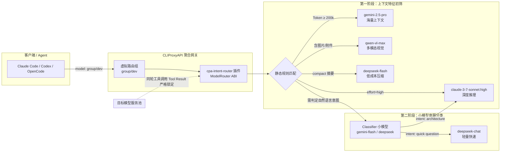

# CPA Intent Router

基于 CLIProxyAPI 动态插件体系实现的上下文感知与小模型意图分类两阶段动态模型路由插件。

---

## 架构与路由流程

```text
┌────────────────────────────────────────────────────────────────────────────────────────────────────────────────────────┐
│  [按意图]   [按规则]   [超长上下文]   [多模态]   [思考深度]     智能决策：首轮动态解析特征与意图，同轮工具调用严格锁定   │
├────────────────────────────────────────────────────────────────────────────────────────────────────────────────────────┤
│                                                                                                                        │
│   ┌─────────────────┐             ┌───────────────────────┐             ┌─● claude-3-7-sonnet:high ───────────服务中─┐ │
│   │   Claude Code   │             │      CLIProxyAPI      │             │   复杂设计 / 深度推理 (effort=high)          │ │
│   │      Codex      │ ──────────► │   cpa-intent-router   │ ──────────► ├─○ gemini-2.5-pro ───────────────已就绪─┤ │
│   │    OpenCode     │             │                       │             │   超长上下文分析 (tokens ≥ 200k)             │ │
│   │    你的 Agent   │             │  虚拟组: group/dev    │             ├─○ deepseek-chat ────────────────就绪─┤ │
│   └─────────────────┘             └───────────────────────┘             │   日常快速问答 (intent="quick question")     │ │
│                                                                         ├─○ qwen-vl-max ──────────────────已就绪─┤ │
│                                                                         │   多模态视觉识别 (images=true)               │ │
│                                                                         └─○ deepseek-flash ───────────────已就绪─┤ │
│                                                                             会话上下文压缩 (compact=true)              │ │
│                                                                                                                        │
│   客户端将请求发往虚拟模型 group/dev，由插件按上下文与意图自动路由至最佳模型，并保持工具调用会话一致。                │
└────────────────────────────────────────────────────────────────────────────────────────────────────────────────────────┘
```



---

## 核心能力

1. **虚拟路由组（Routing Group）**：支持将异构模型编组（如 `group/dev` 或 `dev`），并对外暴露统一虚拟模型入口。
2. **两阶段动态路由分流**：
   - **第一阶段（零额外开销静态规则）**：按 Token 估算阈值、多模态图片输入、推理思考深度要求（`effort`）、客户端标识（`agents`）、会话压缩标志（`compact`）及时间窗口进行前置匹配。
   - **第二阶段（小模型极简意图分类）**：支持自然语言描述意图（如 `"a quick question"`, `"writing or fixing tests"`），前置并发调用轻量模型极简分类（内置 10 分钟 SHA-256 缓存与 Singleflight 防重）。
3. **轮次亲和性锁定（Turn Affinity Locking）**：识别多步工具交互轮次（Tool Call / Tool Result），同轮交互严格锁定在首轮选定模型，防止模型漂移。
4. **模型目录自动注册**：自动将虚拟路由组注入 `/v1/models` 供客户端直接发现与调用。

---

## 构建方式

```bash
# 构建 Linux amd64 动态库插件
CGO_ENABLED=1 GOOS=linux GOARCH=amd64 go build -trimpath -buildmode=c-shared -o cpa-intent-router.so .
```

将生成的 `cpa-intent-router.so` 放置于 CLIProxyAPI 的插件目录（如 `/data/cli/plugins/linux/amd64/`）即可随宿主自动加载。

---

## 配置示例

在 CLIProxyAPI 的 `config.yaml` 中配置插件段（或在插件自身配置文件中声明）：

```yaml
plugins:
  configs:
    cpa-intent-router:
      enabled: true
      gateway_url: "http://127.0.0.1:8000"
      groups:
        - id: "opus-anywhere"
          name: "Opus Anywhere"
          members:
            - "openrouter/google/gemini-2.5-pro"
            - "deepseek-chat"
            - "claude/claude-3-7-sonnet"
          classifier: "gemini/gemini-2.5-flash"
          fallback: "claude/claude-3-7-sonnet"
          rules:
            - use: "openrouter/google/gemini-2.5-pro"
              tokens: 200000
            - use: "deepseek-chat"
              images: true
            - use: "deepseek-chat"
              intent: "a quick question"
            - use: "claude/claude-3-7-sonnet:high"
              effort: "high"
            - use: "deepseek-chat"
              compact: true
            - use: "claude/claude-3-7-sonnet"
              agents: ["claude", "codex"]
```
